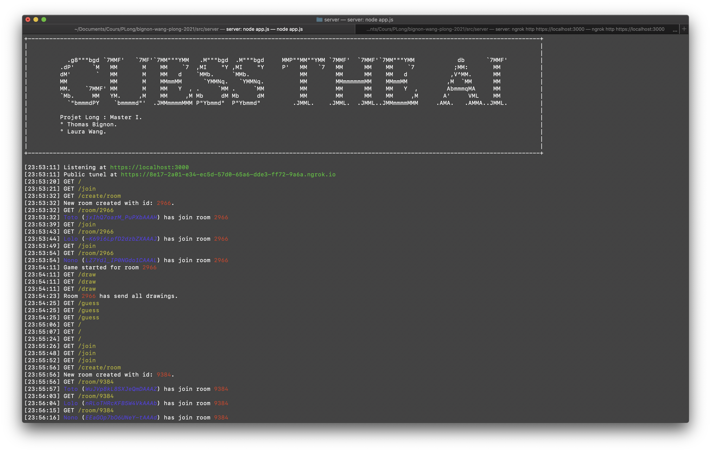
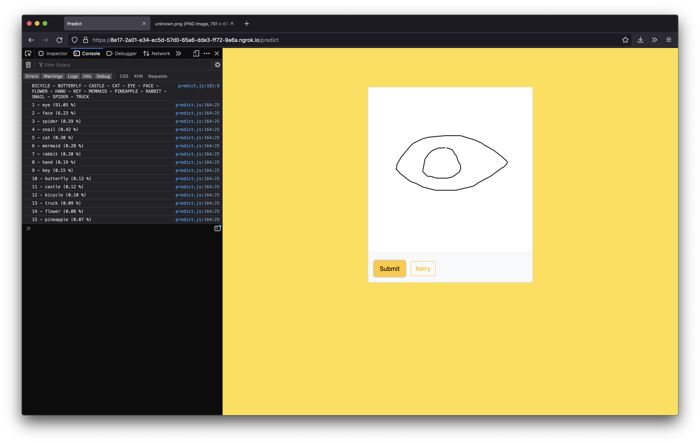
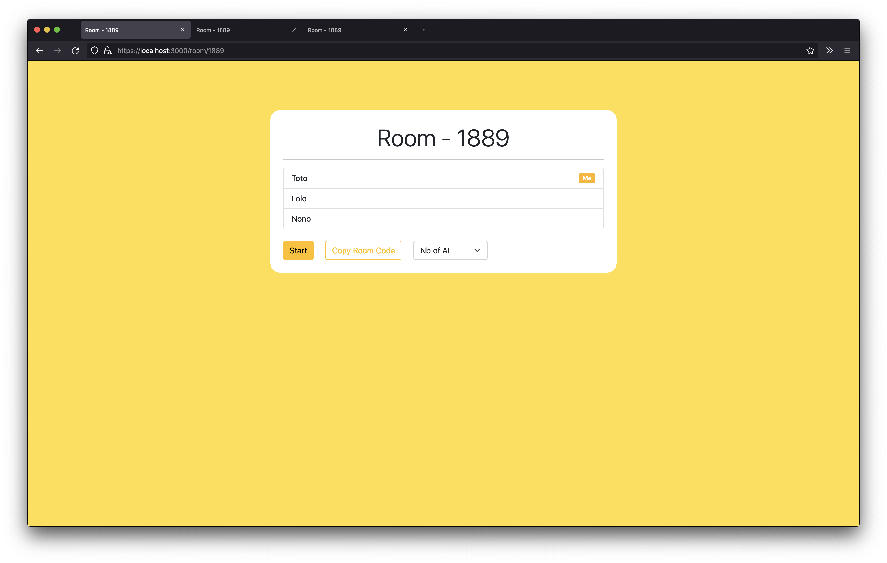
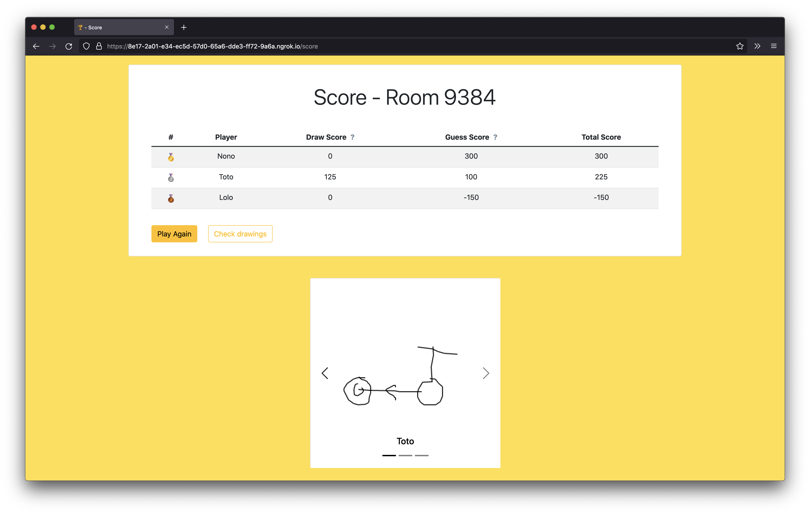
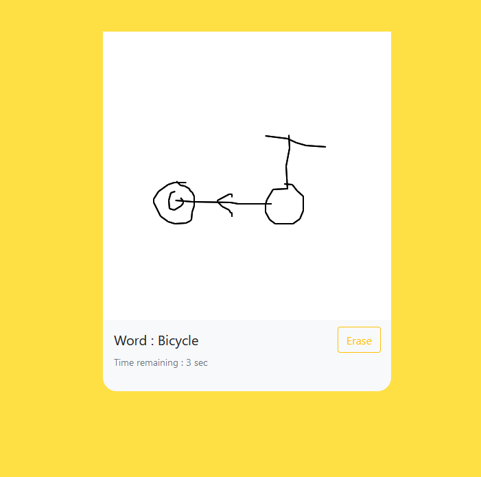

# Guess the IA

> Projet Long de Master 1

Party game où quelques joueurs dessinent un mot proposé. Des IA devront reconnaître les dessins des joueurs et générer d'autres dessins. Les joueurs devront essayer d'associer chaque dessins à chaque joueurs sans se faire avoir par l'IA.


## Installation

Attention, les commandes sont à éxécuter dans le répertoire `src/server`.

```sh
cd src/server
```

- Pour installer les dépendances de Node.js :

```sh
npm install express canvas numjs socket.io cli-progress colors @tensorflow/tfjs-node
```

- Pour télécharger les modèles de `sketch_rnn` et setup le repertoire de génération :

```sh
mkdir generated && mkdir sketch_rnn_model_data && python3 ../notebooks/download_decoder_models.py
```

- Pour mettre en place les clés de chiffrements pour le HTTPS :

```sh
mkdir key && cd key && openssl req -x509 -newkey rsa:2048 -keyout keytmp.pem -out cert.pem -days 365
```

Choisissez une passphrase et gardez la.

```sh
openssl rsa -in keytmp.pem -out key.pem
```

Re-rentrez votre passphrase et remplissez les informations CSR demandées. Pour le champs `Common name`, mettez soit `localhost` soit `*.ngrok.io` selon votre utilisation. Voir la section [Utilisation en ligne](#utilisation-en-ligne).

## Utilisation

Une fois installé, exécutez cette commande pour lancer le serveur web sur le port `3000` :

```sh
node app.js
```

## Utilisation en ligne

Pour pouvoir utiliser le jeu en ligne et permettre à des joueurs hors du réseau local de rejoindre, nous utilisons [ngrok](https://ngrok.com/) qui génère un domaine qui fait un tunel vers `localhost:3000`.
Une fois `ngrok` installé et le serveur lancé, exécuter la commande : 

```sh
ngrok http https://localhost:3000
```

Connectez vous à https://localhost:3000/ et jouez !

### Routes

-  `/` : Page d'accueil.
- `/join` : Rejoindre un salon.
- `/predict` : Tester le modèle de classification. (Ouvrez la console de votre navigateur pour afficher le résultat.)
- `/generate/random` : Générer une image de classe aléatoire. Vous pouvez remplacer `random` par la classe de votre choix. La liste des classe est disponible dans le fichier [`src/server/classes.json`](src/server/classes.json).


### Screenshot







## Architecture

```
.
├── docs/								[ Documents ]
│   ├── journal.org
│   └── presentation.md
├── rapport/								[ Rendu de rapport ]
│   ├── preview.jpg
│   ├── rapport.pdf
│   └── rapport.tex
├── src/		    			             		[ Fichiers ]
│   ├── notebooks/							[ Scripts pour l'entrainement et le téléchargement des modèles ]
│   │   ├── QuickDrawClassification_Thumbnails_Convert.ipynb
│   │   ├── QuickDrawClassification_Thumbnails_Training.ipynb
│   │   └── download_decoder_models.py
│   └── server/								[ Serveur Node.js ]
│       ├── app.js							[ Script du serveur web ]
│       ├── classes.json
│       ├── cnn_model/						        [ Modèle CNN de classification ]
│       │   ├── group1-shard1of2.bin
│       │   ├── group1-shard2of2.bin
│       │   └── model.json
│       ├── generate.js							[ Script pour la génération d'image ]
│       ├── generated/							[ Répertoire de sauvegarde des images générées ]
│       ├── img_processing.js						[ Script pour le traitement et la génération d'images ]
│       ├── key/                                                        [ Clés de chiffrements pour le HTTPS ]
│       │   ├── cert.pem
│       │   ├── key.pem
│       │   └── keytmp.pem
│       ├── public/							[ Répertoire de fichiers statiques du serveur web ]
│       │   ├── html/
│       │   │   ├── draw.html
│       │   │   ├── guess.html
│       │   │   ├── index.html
│       │   │   ├── join.html
│       │   │   ├── predict.html
│       │   │   ├── room.html
│       │   │   └── score.html
│       │   ├── js/
│       │   │   ├── draw.js
│       │   │   ├── guess.js
│       │   │   ├── join.js
│       │   │   ├── predict.js
│       │   │   ├── room.js
│       │   │   └── score.js
│       │   └── style/
│       │       └── style.css
│       ├── sketch_rnn.js						[ Bibliothèque de traitement des modèles RNN ]
│       └── sketch_rnn_model_data/					[ Données des modèles RNN de génération ]
│           ├── bicycle.js
│           ├── butterfly.js
│           ├── castle.js
│           ├── cat.js
│           ├── eye.js
│           ├── face.js
│           ├── flower.js
│           ├── hand.js
│           ├── key.js
│           ├── mermaid.js
│           ├── pineapple.js
│           ├── rabbit.js
│           ├── snail.js
│           ├── spider.js
│           └── truck.js
├── presentation-bignon-wang.pdf                                        [ Présentation ]
└── README.md								[ Fichier README ]

```

## Dépendances

- [Node.js](https://nodejs.org/en/) pour le serveur.
- [Keras](https://keras.io/), et d'autres outils classiques de ML. Voir les imports des [notebooks](src/notebooks/).
- [Google Colab](https://colab.research.google.com/notebooks/welcome.ipynb?hl=fr) pour l'environnement d'entrainement du modèle CNN.
- [Bootstrap](https://getbootstrap.com/) pour le CSS.

#### Dépendances NPM

- [Express](https://www.npmjs.com/package/express) pour le serveur web;
- [Socket.io](https://socket.io/) pour implémenter les WebSockets et faire la communication entre client et serveur.
- [Canvas](https://www.npmjs.com/package/canvas) pour la manipulation de canvas en backend.
- [NumJS](https://www.npmjs.com/package/numjs) pour des manipulation de matrices.
- [Cli-progress](https://www.npmjs.com/package/cli-progress) pour afficher des barres de chargement.
- [Colors.js](https://www.npmjs.com/package/colors) pour collorer les affichages.
- [TensorFlow.js](https://www.npmjs.com/package/@tensorflow/tfjs-node) pour exécuter le modèle de classification.  


## Documents

- [Présentation initiale du projet](docs/presentation.md)
- [Journal de bord](docs/journal.org)
- [Transparent de présentation](presentation-bignon-wang.pdf)
